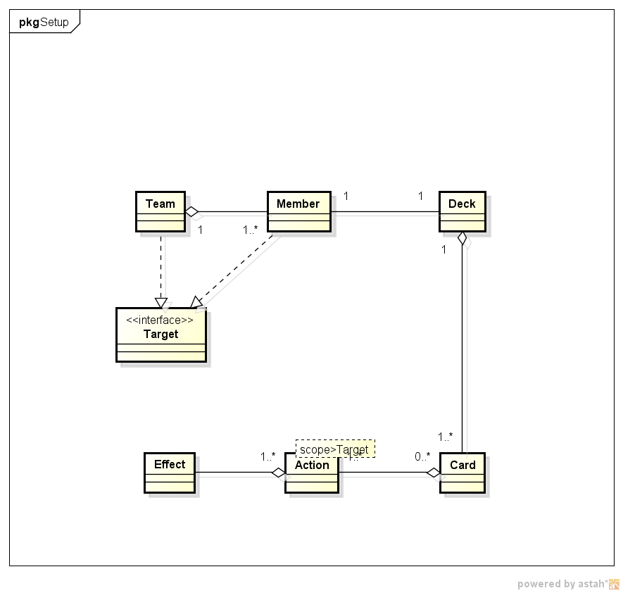
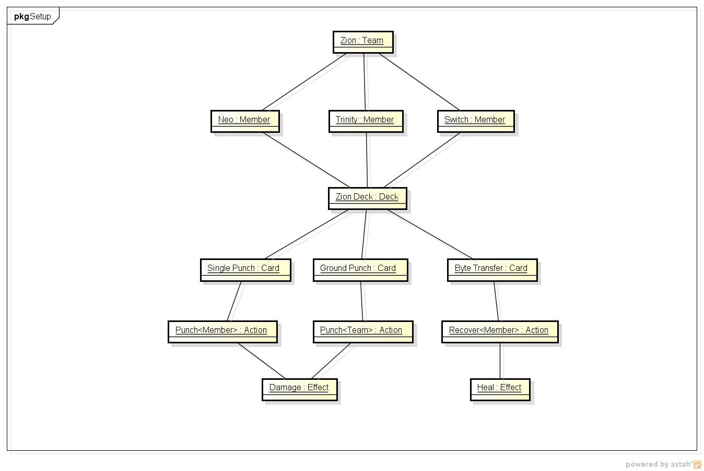
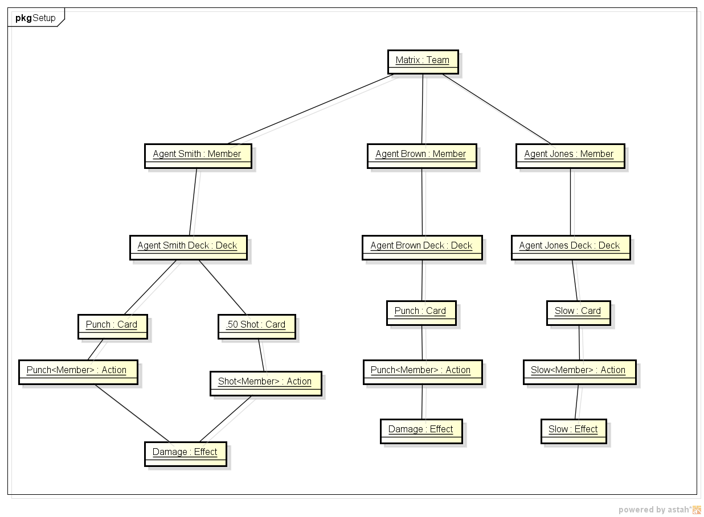
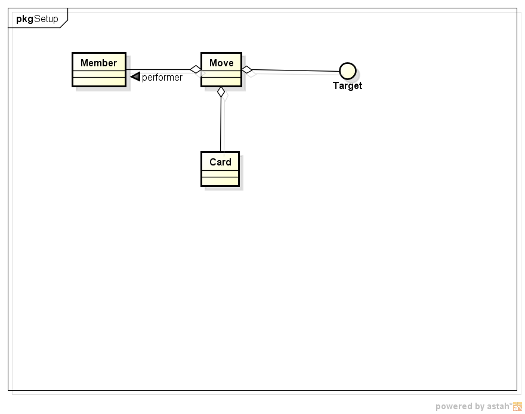
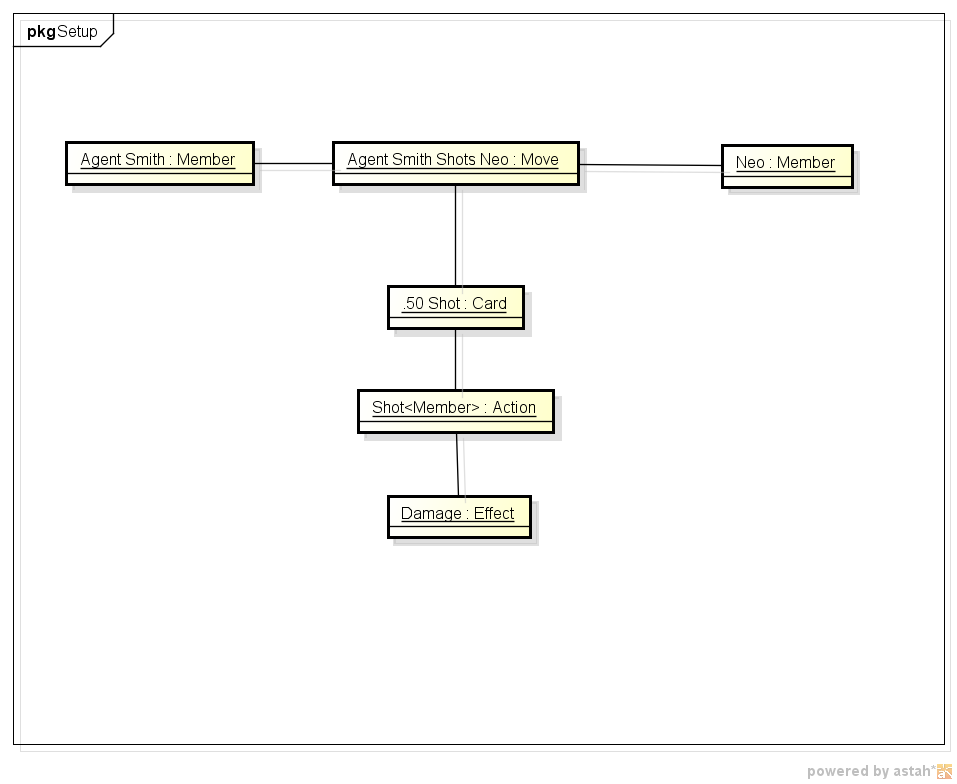

# Battle Design Elements

A Battle is an interaction between two or more Teams. Each Team is composed of
at least one Member. Each Member has one Deck of Cards representing all the Cards
that this Member can use in this Battle. Each Card have one or more Effects, which is the 
composition of what the card does (Action) and to which type of Target the Card act 
(Target). A Card can target any quantity of members or the whole team (all members).

## Diagrams

### Battle Setup Diagrams

This diagram models the state of Battle Setup phase, when we have both teams with
all its players and decks selected. The Battle did not started yet, so no oney played 
any card.

- Class diagram

- Object Diagrams

Here in these diagrams we are setting up two Teams: player team is called `Zion` and is 
composed by three players characters (`Neo`, `Trinity` and `Switch`). The deck of `Zion`
team (`Zion Deck`) is the player's deck with all his cards, i.e, all player characters
share the same deck. Cards have one or more Actions, which are composed by the Action
Effect and the parameter `scope`, which indicates each action scope. Scope parameter
is an implementation of `Target` interface, which at the moment can be of Team 
(when an Action targets the whole team) or Member (when the action targets just one 
character). The Effects element contain sthe algorithm that will be executed each time
the card is player.
In this example we have three cards in `Zion Deck`:
- `Single Punch`: `Single Punch` card have as its effect the `Punch` `Action` applied to
a `Member` instance. This means that `Punch card deals damage to one enemy`;
- `Ground Punch`: now this card is more powerful, having its effect the `Punch` `Action` 
applied to all `Member` instances of determined Team (usually the opposing Team). 
This means that `Ground pound card deals damage to all enemies`;
- `Byte Transfer`: following the same logic we have the `Byte Transfer` card. `Byte Transfer` 
is composed by the `Recover` action acting over a Member (just one character) and executing
the `Heal` behavior.

### Battle Move Diagrams

After the battle is set up the teams start to attack each other by drawing cards and performing
Moves. Each move is created when a card is played and it have references to who performed the movement,
which card is moving and which enemyis the Target of this card.

- Class diagram

Now we create the object that represents an attack. Let's suppose that `Agent Smith` shots with its .50 pistol
at `Neo`:

