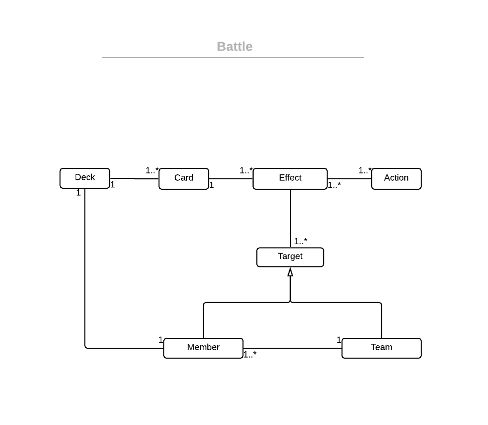

# Battle Design Elements

A Battle is an interaction between two or more Teams. Each Team is composed of
at least one Member. Each Member has one Deck of Cards representing all the Cards
that this Member can use in this Battle. Each Card have one or more Effects, which is the 
composition of what the card does (Action) and to whom the Card act (Target). A Card
can any quantity of members or the whole team (all members).

## General Rules
- Before the battle all the decks will be shuffled. The Team Members controlled by the 
player (player characters) will use the same Deck instance, while the team members of 
the enemy team will have a sepparate deck instance for each Member.
- Card effects should be composable and stackable, i.e., a Card can have more than one
Effect
- 
