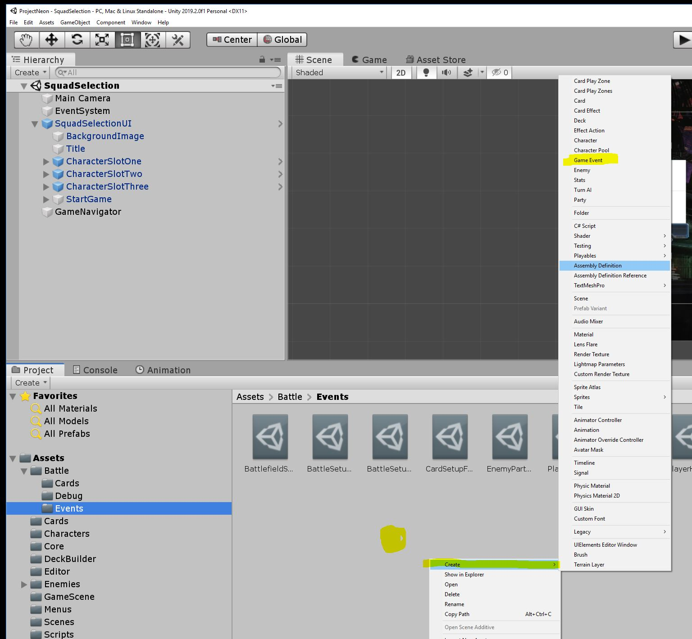
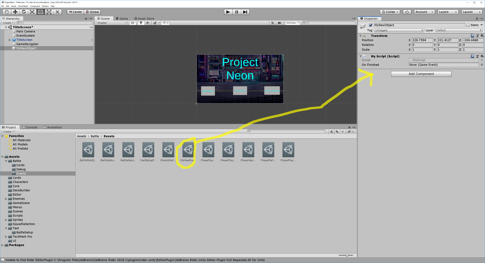
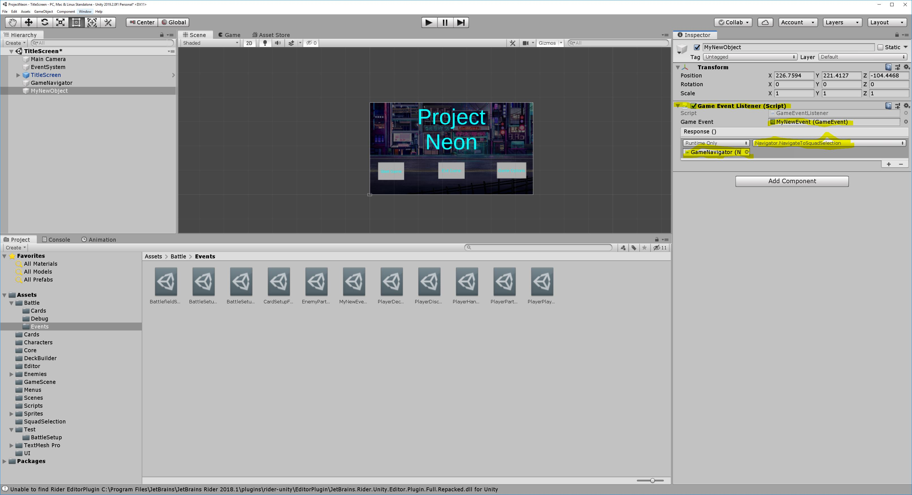

## Unity Game Event Tutorial

----

### Why use Events?

Events enable a loosely-coupled reactive architecture. 

Individual objects care about the things that happened, and not which objects were involved in the thing that happened.

This is especially powerful for adding in new side effects for Game Events. When `PlayerDamaged` we can setup a Sound Effect to play, without it being coupled to exist objects, or even the rules of the battle system. 

----

### How do I create a new Event Type?

GameEvents are ScriptableObjects.
1. Right-click in the assets explorer 
2. Click `Create`
3. Click `Game Event`
4. Name your Event



----

### How do I connect an Event to my Script?

1. Add a SerializeField of type GameObject to your script
2. Go to the component in the editor
3. Drag the Event onto the inspector element



----


### How do I publish an Event that's connected to my Script?

Execute `_myEvent.Publish()` anytime after the `Awake` phase. 

----

### How do I subscribe to an Event that's connected to my Script?

Subscribe to the Event in the `OnEnable` method, and unsubcribe in the `OnDisable` method.

```
void OnEnable()
{
    _myEvent.Subscribe(new GameEventSubscription(
        _myEvent.name, x => CallSomeMethod(), this));
}

void OnDisable()
{
    _myEvent.Unsubscribe(this);
}
```

----

### How do I connect an Event to a method in the Editor, without creating a new Script?

1. Add a `GameEventListener` component to your `GameObject`. 
2. Drag the Event into the component event field
3. Select a `UnityEvent` binding as usual



